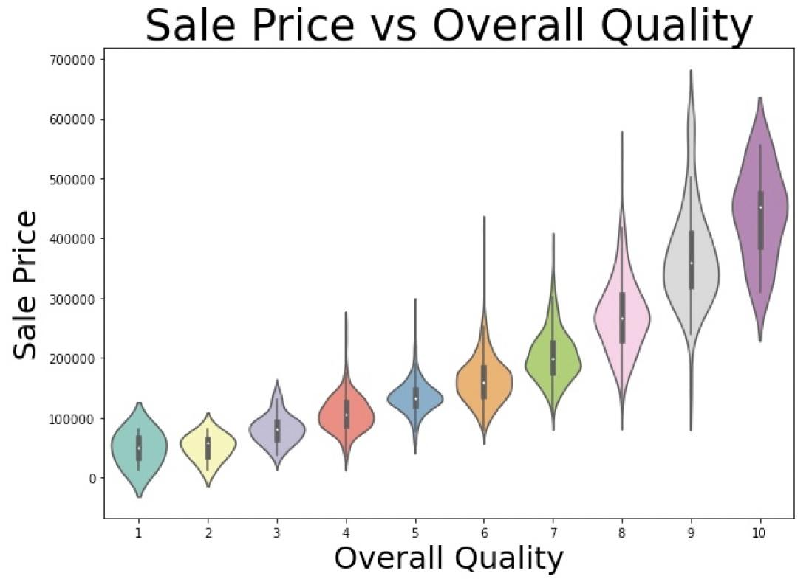

## Ames Housing Data and Kaggle Challenge
### by Jenny James
---

### EDA

#### Data Cleaning
After examining the data, I decided to change several things:
I dropped the one house that had a garage that held more than 4 cars because it was the only one and an outlier
I dropped the houses with more than 2 fireplaces since there were only 6 and they didnt help my model
I replaced the nulls with 0s on both datasets for the following columns: Garage area, BsmtFin SF 2, Garage Cars, Bsmt Half Bath, Bsmt Unf SF, Bsmt Full Bath, Total Bsmt SF
I dropped a house that had more than 5k square feet that was around $100k because it didn't make sense and i didn't want it in my model

### Dummy Columns
I got dummies for the neighborhoods so they would be included as columns and i could use them in my model
I also got dummies for the Kitchen Qual, Street, BsmtFin Type 1, Lot Shape and Exterior 1st so i could include them also
I merged all the dummies with the two datasets and dropped the extra columns.

### New columns
I created a column that was called sq_ft which added the first floor square footage with the second floor square footage
I created a column called age that was this year minus the year the house was built

### Modeling
After selecting home features i wanted to focus on, I did a train test split and examined my model
I did some adding and some removing of features to get the best R2 score i could.
The mean squared error for the train dataset was 79088
The root mean squared error was 26160 so my predicted model can only be off by that much, no more

### Recommendations:
One of the most influential features was overall quality.  There was a direct relationship between it and the sales price.  This feature will be one of the easiest to improve with some simple techniques proposed in my powerpoint presentation.
Paving an unpaved driveway and finishing a basement would also be very influential on the sales price.

